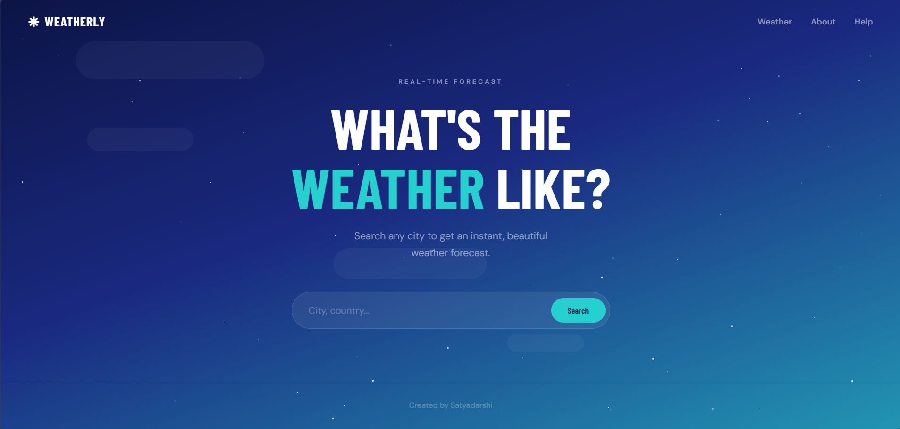
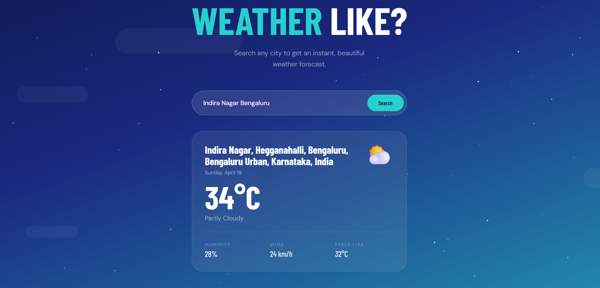

# Weatherly 🌤️

A clean, beautifully designed real-time weather app. Search any city in the world and instantly get current conditions.

🔗 **Live demo:** [weather-website-production-12f5.up.railway.app](https://weather-website-production-12f5.up.railway.app/)

---

## Screenshots





---

## Features

- 🌍 Search any city, town, or address worldwide
- 🌡️ Current temperature and feels-like temperature
- 💧 Humidity and wind speed
- 🌤️ Weather description with matching emoji icon
- ✨ Animated starfield and drifting cloud background
- 📱 Fully responsive — works on mobile and desktop

---

## Tech Stack

| Layer | Technology |
|---|---|
| Runtime | Node.js |
| Framework | Express |
| Templating | Handlebars (hbs) |
| Location API | [Mapbox Geocoding](https://mapbox.com) |
| Weather API | [Weatherstack](https://weatherstack.com) |
| Hosting | [Railway](https://railway.app) |

---

## Getting Started

### Prerequisites
- Node.js v14 or higher
- A [Mapbox](https://mapbox.com) account (free)
- A [Weatherstack](https://weatherstack.com) account (free)

### Installation

1. **Clone the repo**
   ```bash
   git clone https://github.com/satya-darshi/weather-website.git
   cd weather-website
   ```

2. **Install dependencies**
   ```bash
   npm install
   ```

3. **Create a `.env` file** in the project root
   ```
   MAPBOX_TOKEN=your_mapbox_token_here
   WEATHERSTACK_KEY=your_weatherstack_key_here
   ```

4. **Start the development server**
   ```bash
   npm run dev
   ```

5. Open [http://localhost:3000](http://localhost:3000)

---

## Project Structure

```
weather-website/
├── public/
│   ├── css/
│   │   └── styles.css       # All styles
│   └── js/
│       └── app.js           # Frontend JS (search, fetch, render)
├── src/
│   ├── utils/
│   │   ├── forecast.js      # Weatherstack API call
│   │   └── geocode.js       # Mapbox geocoding call
│   └── app.js               # Express server & routes
└── templates/
    ├── partials/
    │   ├── header.hbs
    │   └── footer.hbs
    └── views/
        ├── index.hbs        # Home / search page
        ├── about.hbs        # About page
        ├── help.hbs         # Help / FAQ page
        └── 404.hbs          # 404 page
```

---

## Deployment

This app is hosted on **Railway** and deploys automatically on every push to the `master` branch.

Environment variables (`MAPBOX_TOKEN` and `WEATHERSTACK_KEY`) are configured directly in the Railway dashboard under the Variables tab — they are never committed to the repository.

---

## Created by

**Satyadarshi** — [github.com/satya-darshi](https://github.com/satya-darshi)
